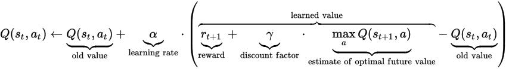

# Self-Driving Agent Report

## 1. Implementation of a Basic Driving Agent

As starting task, we will move the smartcab around the environment using a random approach. The set of possible actions will be: None, forward, left, right. The deadline will be set to false, but this doesn't mean that smartcab has an infinite number of moves as can see on code of the file **smartcab/environment.py** (but will increase a lot the number of moves available).

Observations from simulation:

1. Normally the smartcab action is not optimal, but normally reaches the destination because has a lot of moves available to reach the destination.
2. The environment  doesn't allow any agent to execute and action that violates traffic rules, but a strong negative reward is applied.

## 2. Inform the Driving Agent

The next task  is to identify a set of states that are appropriate for modeling the smartcab and environment. 

All the information we receive come from the environment and the planner.

Sensing the environment provide us with these inputs:

- light:
    - Possible values: Red / Green
- oncoming:
    - Possible values: None / Forward / Right / Left
    - Indicates if there is a car oncoming and the action wants to execute.
- right:
    - Possible values: None / Forward / Right / Left
    - Indicates if there is a car approaching from the right oncoming and 
    the action wants to execute.
- left:
    - Possible values: None / Forward / Right / Left
    - Indicates if there is a car approaching from the left oncoming and 
    the action wants to execute.

Also from the environment we can obtain the deadline, that is the number of remaining moves to reach the destination.

The planner provides next_waypoint, with these possible values: Forward, Right and Left.

For representing the state we will use: **next_waypoint**, **light**, **oncoming**, **right** and **left**.

Having in mind we use *next_waypoint*, is not very useful to also use *deadline*. Also *deadline* will increase considerably the number of possible states, and would penalize the Q-Learning implementation.

The information from *light*, *oncoming*, *right* and *left* can help Q-Learning to avoid traffic violations. The information from *next_waypoint* can help Q-Learning to reach the destination as soon as possible.
 
Having in mind the properties used for the state, and possible values for each of these, the total number of different states are: 3 x 2 x 4 x 4 x 4. This means a total of 384 states at a given time.

## 3. Implement a Q-Learning Driving Agent

The third task is to implement the Q-Learning algorithm for the driving agent. The core of the algorithm is a simple value iteration update. It assumes the old value and makes a correction based on the new information (Source: [Wikipedia](https://en.wikipedia.org/wiki/Q-learning)):



Before proceeding to the simulation, some parameter values should be set.

In the formula shown above, two contants can be seen:
- **alpha_rate (α)** or **learning rate**: Determines to what extent the newly acquired information will override the old information.
- **gamma rate (γ)** or **discount factor**: Determines the importance of future rewards.

Another important parameter when *LearningAgent* should choose an action is the **epsilon_rate (ε)** or **exploration rate**. This parameter determines when to explore new states, or when to exploit already learn information.

Finally another important value is the **Q init-value**, that is the value assigned to initialize the *Q matrix*. Please, notice that in the code I don't make a static initialization. Instead, in the method **get_q_value** I return **self.q_init_value** if no value for the key is found:

~~~~
def get_q_value(self, state, action):
    key = (state, action)
    return self.q_matrix.get(key, self.q_init_value)
~~~~

The param **self.q_init_value** can be set on the parameters of the *LearningAgent* constructor.

In my first attempt I will try with a very *exploratory* *QLearnAgent*. I will assign these values: *alpha_rate = 0.7*, *gamma rate = 0.5*, *epsilon_rate = 0.9* and *Q init-value = 10* (in fact are the default values defined in the constructor of *LearningAgent*).

The simulation will be executed 100 times, with enforce_deadline to True. Some temporal code has been created to generate stats that I will analyze.

### 3.1. Analysis of generated data {#section}


```python
import pandas as pd

data_q_first = pd.read_csv("smartcab/q-agent_first_stats.csv", index_col=0)
```

The generated stats consist on a table containing 100 rows (one by simulation round), and 6 columns:
- **simulation_round**: The round number of the simulation.
- **success**: True if the agent reached the destination.
- **cum_reward**: The accumulated reward in that simulation.
- **explored_states_cum**: The accumulated number of states explored.
- **traffic_violations_count**: The traffic violations that occurred in that simulation.
- **actions_count**: The actions taken in that simulation.

Let's explore the 10 first rounds:


```python
data_q_first.head(10)
```


<div>
<table border="1" class="dataframe">
  <thead>
    <tr style="text-align: right;">
      <th></th>
      <th>simulation_round</th>
      <th>success</th>
      <th>cum_reward</th>
      <th>explored_states_cum</th>
      <th>traffic_violations_count</th>
      <th>actions_count</th>
    </tr>
  </thead>
  <tbody>
    <tr>
      <th>0</th>
      <td>1</td>
      <td>True</td>
      <td>-6.5</td>
      <td>10</td>
      <td>5</td>
      <td>16</td>
    </tr>
    <tr>
      <th>1</th>
      <td>2</td>
      <td>True</td>
      <td>3.5</td>
      <td>21</td>
      <td>5</td>
      <td>16</td>
    </tr>
    <tr>
      <th>2</th>
      <td>3</td>
      <td>False</td>
      <td>-9.0</td>
      <td>29</td>
      <td>7</td>
      <td>30</td>
    </tr>
    <tr>
      <th>3</th>
      <td>4</td>
      <td>False</td>
      <td>4.5</td>
      <td>31</td>
      <td>5</td>
      <td>20</td>
    </tr>
    <tr>
      <th>4</th>
      <td>5</td>
      <td>False</td>
      <td>-9.5</td>
      <td>31</td>
      <td>12</td>
      <td>35</td>
    </tr>
    <tr>
      <th>5</th>
      <td>6</td>
      <td>False</td>
      <td>3.5</td>
      <td>31</td>
      <td>8</td>
      <td>30</td>
    </tr>
    <tr>
      <th>6</th>
      <td>7</td>
      <td>False</td>
      <td>-2.5</td>
      <td>32</td>
      <td>7</td>
      <td>25</td>
    </tr>
    <tr>
      <th>7</th>
      <td>8</td>
      <td>False</td>
      <td>-11.0</td>
      <td>35</td>
      <td>8</td>
      <td>40</td>
    </tr>
    <tr>
      <th>8</th>
      <td>9</td>
      <td>False</td>
      <td>-3.5</td>
      <td>36</td>
      <td>7</td>
      <td>25</td>
    </tr>
    <tr>
      <th>9</th>
      <td>10</td>
      <td>False</td>
      <td>-5.0</td>
      <td>39</td>
      <td>10</td>
      <td>25</td>
    </tr>
  </tbody>
</table>
</div>


We see that normally doesn't have success and commits a lot of traffic violations. The accumulated reward is normally negative. The explored states increases as rounds are done.

Let's see now the 10 last iterations:


```python
data_q_first.tail(10)
```


<div>
<table border="1" class="dataframe">
  <thead>
    <tr style="text-align: right;">
      <th></th>
      <th>simulation_round</th>
      <th>success</th>
      <th>cum_reward</th>
      <th>explored_states_cum</th>
      <th>traffic_violations_count</th>
      <th>actions_count</th>
    </tr>
  </thead>
  <tbody>
    <tr>
      <th>90</th>
      <td>91</td>
      <td>False</td>
      <td>2.0</td>
      <td>110</td>
      <td>7</td>
      <td>20</td>
    </tr>
    <tr>
      <th>91</th>
      <td>92</td>
      <td>False</td>
      <td>-4.5</td>
      <td>110</td>
      <td>9</td>
      <td>25</td>
    </tr>
    <tr>
      <th>92</th>
      <td>93</td>
      <td>False</td>
      <td>1.0</td>
      <td>111</td>
      <td>6</td>
      <td>30</td>
    </tr>
    <tr>
      <th>93</th>
      <td>94</td>
      <td>False</td>
      <td>0.5</td>
      <td>111</td>
      <td>5</td>
      <td>20</td>
    </tr>
    <tr>
      <th>94</th>
      <td>95</td>
      <td>False</td>
      <td>-4.0</td>
      <td>111</td>
      <td>5</td>
      <td>20</td>
    </tr>
    <tr>
      <th>95</th>
      <td>96</td>
      <td>False</td>
      <td>-2.0</td>
      <td>112</td>
      <td>7</td>
      <td>20</td>
    </tr>
    <tr>
      <th>96</th>
      <td>97</td>
      <td>True</td>
      <td>7.0</td>
      <td>112</td>
      <td>6</td>
      <td>24</td>
    </tr>
    <tr>
      <th>97</th>
      <td>98</td>
      <td>False</td>
      <td>-7.5</td>
      <td>112</td>
      <td>12</td>
      <td>40</td>
    </tr>
    <tr>
      <th>98</th>
      <td>99</td>
      <td>False</td>
      <td>10.5</td>
      <td>112</td>
      <td>3</td>
      <td>20</td>
    </tr>
    <tr>
      <th>99</th>
      <td>100</td>
      <td>False</td>
      <td>-12.5</td>
      <td>112</td>
      <td>10</td>
      <td>30</td>
    </tr>
  </tbody>
</table>
</div>


I didn't notice many changes with respect to the basic agent of first section. The *exploratory nature* of our *LearnAgent* causes that in the 100 first simulation explores a lot of unknown states. But it is learning, so if it can perform more simulations, would perform much better than the basic agent.

## 4. Improve the Q-Learning Driving Agent

Now let's tune the values for the **Q init value**, the **learning rate (alpha)**, **the discount factor (gamma)** and the **exploration rate (epsilon)**.

I will use *Grid Search* technique to tune these parameters.

### 4.1. Grid Search

I will do a *Grid Search* with these range of values:
- *q_init_values*: 0.0, 5.0, 10 (3 values)
- *alpha_rate*: 0.00, 0.25, 0.50, 0.75, 1.00 (5 values)
- *epsilon_rate*: 0.00, 0.25, 0.50, 0.75, 1.00 (5 values)
- *gamma_rate*: 0.00, 0.25, 0.50, 0.75, 1.00 (5 values)

The total of combinations will be 375 (3x5x5x5). For each of the combinations, 100 simulations will be performed. This means 37.500 simulations will be done.

For each combination of parameters we will aggregatte **ONLY** the results from the last 10 simulations of the *QLearningAgent*. These aggregated stats will be stored on a csv file, that we will analyze.


```python
import pandas as pd

tuning_data = pd.read_csv("other/qlearn_agent_tuning_results.csv", index_col=0)
```

Let's see the first row to understand the columns contained:


```python
tuning_data.head(1)
```


<div>
<table border="1" class="dataframe">
  <thead>
    <tr style="text-align: right;">
      <th></th>
      <th>q_init_value</th>
      <th>alpha_rate</th>
      <th>epsilon_rate</th>
      <th>gamma_rate</th>
      <th>success_perc</th>
      <th>traffic_violations_avg</th>
      <th>explored_states_avg</th>
      <th>reward_cum_avg</th>
      <th>actions_avg</th>
    </tr>
  </thead>
  <tbody>
    <tr>
      <th>0</th>
      <td>0.0</td>
      <td>0.0</td>
      <td>0.0</td>
      <td>0.0</td>
      <td>30.0</td>
      <td>7.2</td>
      <td>120.0</td>
      <td>-2.15</td>
      <td>27.4</td>
    </tr>
  </tbody>
</table>
</div>


Each row corresponds to a simulation. The columns are:
- **q_init_value**: The Q initial value used in that simulation.
- **alpha_rate**: The alpha rate value used in that simulation.
- **epsilon_rate**: The epsilon rate value used in that simulation.
- **gamma_rate**: The gamma rate value used in that simulation.
- **success_perc**: The percentage of success in that simulation (only for 10 last simulations done).
- **traffic_violations_avg**: The traffic violation on average in that simulation (only for 10 last simulations done).
- **explored_states_avg**: The explored states on average in that simulation (only for 10 last simulations done).
- **reward_cum_avg**: The accumulated reward on average in that simulation (only for 10 last simulations done).
- **actions_avg**: The actions done on average in that simulation (only for 10 last simulations done).

### 4.2. An optimal policy

Before looking for the optimal combination of parameters, we should define an optimal policy for the *LearnAgent*.

In my opinion an optimal policy for the smartcab is one that (in order of importance):
1. Minimizes the number of traffic violations.
2. Maximizes the success.

We can also consider in the policy that the number of actions taken are the least possible.

### 4.3. Looking for the best combination of parameters

Let's start describing the data in the generated stats:


```python
tuning_data.describe()
```


<div>
<table border="1" class="dataframe">
  <thead>
    <tr style="text-align: right;">
      <th></th>
      <th>q_init_value</th>
      <th>alpha_rate</th>
      <th>epsilon_rate</th>
      <th>gamma_rate</th>
      <th>success_perc</th>
      <th>traffic_violations_avg</th>
      <th>explored_states_avg</th>
      <th>reward_cum_avg</th>
      <th>actions_avg</th>
    </tr>
  </thead>
  <tbody>
    <tr>
      <th>count</th>
      <td>81.000000</td>
      <td>81.000000</td>
      <td>81.000000</td>
      <td>81.000000</td>
      <td>81.000000</td>
      <td>81.000000</td>
      <td>81.000000</td>
      <td>81.000000</td>
      <td>81.000000</td>
    </tr>
    <tr>
      <th>mean</th>
      <td>5.000000</td>
      <td>0.500000</td>
      <td>0.500000</td>
      <td>0.500000</td>
      <td>20.617284</td>
      <td>6.454321</td>
      <td>96.527160</td>
      <td>-1.064815</td>
      <td>26.695062</td>
    </tr>
    <tr>
      <th>std</th>
      <td>4.107919</td>
      <td>0.410792</td>
      <td>0.410792</td>
      <td>0.410792</td>
      <td>19.896336</td>
      <td>3.013928</td>
      <td>11.978178</td>
      <td>4.228559</td>
      <td>4.466428</td>
    </tr>
    <tr>
      <th>min</th>
      <td>0.000000</td>
      <td>0.000000</td>
      <td>0.000000</td>
      <td>0.000000</td>
      <td>0.000000</td>
      <td>0.000000</td>
      <td>63.100000</td>
      <td>-11.300000</td>
      <td>6.600000</td>
    </tr>
    <tr>
      <th>25%</th>
      <td>0.000000</td>
      <td>0.000000</td>
      <td>0.000000</td>
      <td>0.000000</td>
      <td>10.000000</td>
      <td>6.100000</td>
      <td>88.200000</td>
      <td>-3.350000</td>
      <td>24.000000</td>
    </tr>
    <tr>
      <th>50%</th>
      <td>5.000000</td>
      <td>0.500000</td>
      <td>0.500000</td>
      <td>0.500000</td>
      <td>20.000000</td>
      <td>7.300000</td>
      <td>96.800000</td>
      <td>-1.850000</td>
      <td>27.500000</td>
    </tr>
    <tr>
      <th>75%</th>
      <td>10.000000</td>
      <td>1.000000</td>
      <td>1.000000</td>
      <td>1.000000</td>
      <td>20.000000</td>
      <td>8.600000</td>
      <td>105.600000</td>
      <td>-0.050000</td>
      <td>29.500000</td>
    </tr>
    <tr>
      <th>max</th>
      <td>10.000000</td>
      <td>1.000000</td>
      <td>1.000000</td>
      <td>1.000000</td>
      <td>100.000000</td>
      <td>11.100000</td>
      <td>120.000000</td>
      <td>12.550000</td>
      <td>36.500000</td>
    </tr>
  </tbody>
</table>
</div>


The minimum *traffic_violations_avg* is 0.0, the maximum for *success_perc* is 100% and the minimum for *actions_avg* is 6.6.

Let's look for rows where *traffic_violations_avg <= 1* and *success_perc >= 90*:


```python
tuning_data_rows = tuning_data[(tuning_data['traffic_violations_avg'] <= 1) & (tuning_data['success_perc'] >= 90)]
tuning_data_rows.head()
```


<div>
<table border="1" class="dataframe">
  <thead>
    <tr style="text-align: right;">
      <th></th>
      <th>q_init_value</th>
      <th>alpha_rate</th>
      <th>epsilon_rate</th>
      <th>gamma_rate</th>
      <th>success_perc</th>
      <th>traffic_violations_avg</th>
      <th>explored_states_avg</th>
      <th>reward_cum_avg</th>
      <th>actions_avg</th>
    </tr>
  </thead>
  <tbody>
    <tr>
      <th>10</th>
      <td>0.0</td>
      <td>0.5</td>
      <td>0.0</td>
      <td>0.5</td>
      <td>100.0</td>
      <td>0.1</td>
      <td>67.9</td>
      <td>10.8</td>
      <td>13.6</td>
    </tr>
  </tbody>
</table>
</div>


In the row 10 we can see that in the 10 last simulations done, the **success_perc=100** and **traffic_violations_avg=0.1**. We can also see that **actions_avg=13.6**.

It seems that the price to pay for minimize *traffic_violations_avg* is being far from the minimum *actions_avg* .

So based in my criteria for an optimal policy, the parameter values to use are:
- *q_init_value* = 0.0
- *alpha_rate* = 0.5
- *epsilon_rate* = 0.0
- *gamma rate* = 0.5

These values define a *conservative* agent, that with only 100 simulations rounds done, perform much better than *explorative* agents. But let's see in detail the influence of the parameters.

### 4.4. How these combination of parameters influence *LearnAgent* behaviour

To proceed to the analysis, let's generate detailed stats for a *LearnAgent* using these values for parameters.

I will execute 100 simulations and store the stats on a cvs file. The data generated follows the same pattern that data generated on [section 3.1](###3.1).


```python
stats_tuned = pd.read_csv("smartcab/stats_tuned_qlearn_agent.csv", index_col=0)
```

#### 4.4.1. *epsilon_rate* and *q_init_value*

The *epsilon_rate=0.0* determines that the *QLearningAgent* will always try to exploit what he has already learn. Also a *q_init_value = 0.0* means that the *QLearningAgent* will be very conservative from the very beginning. 

The combination of these two parameters determines that the *QLearningAgent* will leave soon to explore new states. Let's visualize this behaviour:


```python
from altair import Chart

Chart(stats_tuned).mark_line().encode(
    x= 'simulation_round',
    y='explored_states_cum'
)
```

[](images/vega_chart_1.png)


As expected abount round 10 onwards the number of explored states increses much slower that at the initial rounds. It seems
that explored will stabilize around 60-65, but a test with more than 100 round simulations is needed to confirm this trend.

Other important aspect is the the number of possible locations for the smartcab:


There are 48 possible locations (8 x 6 grid). In the simulation there are 4 smartcabs in total.

This means that there are very few chances for our *QLearnAgent* to learn situations where the actions taken by the other cars are important to avoid traffic violations. So it will need many simulations to fully learn to avoid traffic violations, because will have few chances to learn to correctly interact with other agents.

Let's visualize the correlation between *simulation_rounds* and *traffic_violations_count*:


```python
from altair import Chart

Chart(stats_tuned).mark_line().encode(
    x= 'simulation_round',
    y= 'traffic_violations_count'
)
```


As expected we can see he *QLearnAgent* needs many round to learn to avoid traffic penalties.

#### 4.4.2. *gamma_rate*

As explained previously, *gamma_rate* determines the importance of future rewards. A *gamma_rate=0* causes that future rewards have no influence on the learned value. A *gamma_rate=1* causes that future rewards have a lot of influence on the learned value.

Our state includes *next_waypoint* (provided by the *Planner*), and is the only information we have to reach the destination. So is important that our *QLearnAgent* learns that following *next_waypoint* is important. Going to the *next_waypoint* without traffic violations produces a reward of 2.00, and from time to time a reward of 12.00 is received because the destination has been reach (2.00 + 10.00).

Also the next state depends on the movements of other agents, and from any state is possible to be transition to any of the other states, so this is a good reason to downplay future rewards.

I our case *gamma_rate=0.5*, but probably tt does not have much influence.

#### 4.4.3. *alpha_rate*

The *alpha_rate=0.5* makes sense, becauses the *QLearnAgent* learns that following the *next_waypoint* is good because normally receives a *R=2.00*, but from time to time it receives a *R=12.00*. But this is a little bit random, because the *next_waypoint* has no correlation with the distance to the destination. Just following *next_waypoint* as much as possible is good to reach the destination.
