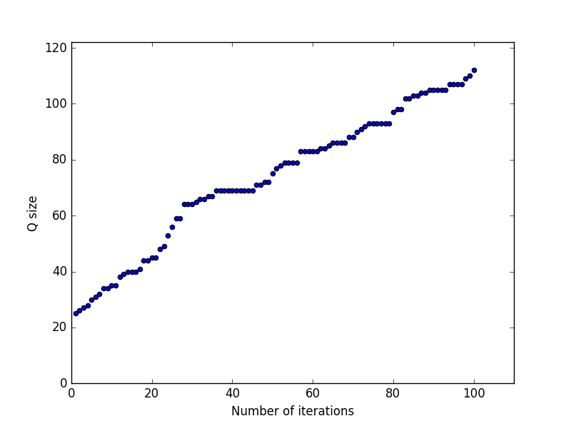
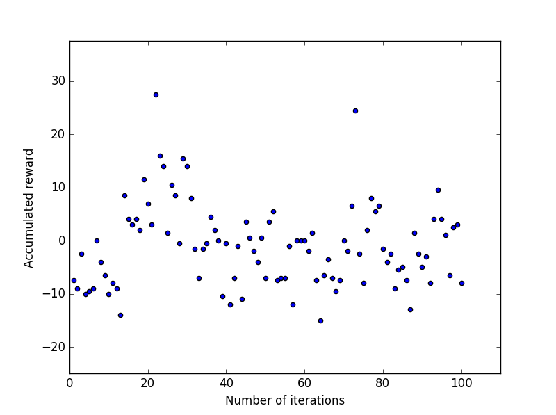

<h1>Self-Driving Agent Report</h1>

<h2>1. Implementation of a Basic Driving Agent</h2>

As starting task, we will move the smartcab around the environment using a random approach. The set of possible actions will be: None, forward, left, right. The deadline will be set to false, but this doesn't mean that smartcab has an infinite number of moves as can see on code of the file **smartcab/environment.py** (but will increase a lot the number of moves available).

The code corresponding to this agent can be found on the class **RandomAgent** at the file **smartcab/agents.py**.

Observations from simulation:

1. Normally the smartcab action is not optimal, but normally reaches the destination because has a lot of moves available to reach the destination.
2. The environment  doesn't allow any agent to execute and action that violates traffic rules, but a strong negative reward is applied.

<h2>2. Inform the Driving Agent</h2>

The next task  is to identify a set of states that are appropriate for modeling the smartcab and environment. 

All the information we receive come from the environment and the planner.

Sensing the environment provide us with these inputs:

- light:
    - Possible values: Red / Green
- oncoming:
    - Possible values: None / Forward / Right / Left
    - Indicates if there is a car oncoming and the action wants to execute.
- right:
    - Possible values: None / Forward / Right / Left
    - Indicates if there is a car approaching from the right oncoming and 
    the action wants to execute.
- left:
    - Possible values: None / Forward / Right / Left
    - Indicates if there is a car approaching from the left oncoming and 
    the action wants to execute.

Also from the environment we can obtain the deadline, that is the number of remaining moves to reach the destination.

The planner provides next_waypoint, with these possible values: Forward, Right and Left.

For representing the state we will use: **next_waypoint**, **light**, **oncoming**, **right** and **left**.

Having in mind we use *next_waypoint*, is not very useful to also use *deadline*. Also *deadline* will increase considerably the number of possible states, and would penalize the Q-Learning implementation.

The information from *light*, *oncoming*, *right* and *left* can help Q-Learning to avoid traffic violations. The information from *next_waypoint* can help Q-Learning to reach the destination as soon as possible.
 
Having in mind the properties used for the state, and possible values for each of these, the total number of different states are: 3 x 2 x 4 x 4 x 4. This means a total of 384 states at a given time.

<h2>3. Implement a Q-Learning Driving Agent</h2>

The third task is to implement the Q-Learning algorithm for the driving agent. The code corresponding to this agent can be found on the class **QLearningAgent** at the file **smartcab/agents.py**.

Before proceeding to the simulation, the values for three important constants should be assigned:
- **alpha_rate (α)** or **learning rate**: Determines to what extent the newly acquired information will override the old information.
- **epsilon_rate (ε)** or **exploration rate**: Determines when to explore or when to exploit the already learn information.
- **gamma rate (γ)** or **discount factor**: Determines the importance of future rewards.

We will execute 100 simulations with enforce_deadline to True, with these values: **alpha_rate = 0.9**, **epsilon_rate = 0.1**, **gamma rate = 0.5**.

Some code to produce some plots has been added.

First let's analyze a scatter plot that correlates number of simulations executed (iterations) with size of the Q matrix:



As we can see in the plot, as simulations are executed the number of values in Q matrix increases.

Now let's analyze a scatter plot that correlates number of iterations with accumulated reward for each of the iterations:



We don't see that as the number of iterations increase the agent gets better accumulated rewards. Maybe the assigned values for the constants were poorly chosen.

Now let's see the number of times q-learner agent has achieved the destination:
- Success: 21 times
- Fail: 79 times

In the first section of this report we saw that the random agent normally was successfully, but we must consider that the deadline was set to false. To make a fairer comparison, lets compare with a random agent with deadline set to true.

Let's see the number of times random agent has achieved the destination:
- Success: 16 times
- Fail: 84 times

There is not too much difference between the success ratio of the *RandomAgent* and the *QLearningAgent*. As said previously maybe the values for the constants were poorly chosen. Other options are that perform 100 simulations are not enough for the 
*QLearningAgent*, or maybe the q-learn algorithm is bad implemented.

<h2>4. Improve the Q-Learning Driving Agent</h2>

Now let's tune the values for the **learning rate (alpha)**, **the discount factor (gamma)** and the **exploration rate (epsilon)**. 

We will perform many simulations with many combinations of these parameters, and the we will report the results to see what 
is the best combination. The correspoding code used to generate this data can be found on **smartcab/main_qlearn_agent_tuning.py**.

The results of the simulations will be stored on a csv file, that we will analyze:


```python
import pandas as pd

tuning_data = pd.read_csv("smartcab/qlearn_agent_tuning_results.csv")
tuning_data.describe()
```


<div>
<table border="1" class="dataframe">
  <thead>
    <tr style="text-align: right;">
      <th></th>
      <th>Unnamed: 0</th>
      <th>alpha_rate</th>
      <th>epsilon_rate</th>
      <th>gamma_rate</th>
      <th>successPerc</th>
      <th>actionsAvg</th>
      <th>cumRewardAvg</th>
    </tr>
  </thead>
  <tbody>
    <tr>
      <th>count</th>
      <td>1000.000000</td>
      <td>1000.000000</td>
      <td>1000.000000</td>
      <td>1000.000000</td>
      <td>1000.000000</td>
      <td>1000.000000</td>
      <td>1000.000000</td>
    </tr>
    <tr>
      <th>mean</th>
      <td>499.500000</td>
      <td>0.500000</td>
      <td>0.500000</td>
      <td>0.500000</td>
      <td>21.585000</td>
      <td>26.762000</td>
      <td>-1.201770</td>
    </tr>
    <tr>
      <th>std</th>
      <td>288.819436</td>
      <td>0.319302</td>
      <td>0.319302</td>
      <td>0.319302</td>
      <td>11.008268</td>
      <td>1.983252</td>
      <td>3.540282</td>
    </tr>
    <tr>
      <th>min</th>
      <td>0.000000</td>
      <td>0.000000</td>
      <td>0.000000</td>
      <td>0.000000</td>
      <td>0.000000</td>
      <td>13.000000</td>
      <td>-15.305000</td>
    </tr>
    <tr>
      <th>25%</th>
      <td>249.750000</td>
      <td>0.222222</td>
      <td>0.222222</td>
      <td>0.222222</td>
      <td>16.000000</td>
      <td>26.000000</td>
      <td>-2.835000</td>
    </tr>
    <tr>
      <th>50%</th>
      <td>499.500000</td>
      <td>0.500000</td>
      <td>0.500000</td>
      <td>0.500000</td>
      <td>20.000000</td>
      <td>27.000000</td>
      <td>-2.142500</td>
    </tr>
    <tr>
      <th>75%</th>
      <td>749.250000</td>
      <td>0.777778</td>
      <td>0.777778</td>
      <td>0.777778</td>
      <td>24.000000</td>
      <td>28.000000</td>
      <td>-0.788750</td>
    </tr>
    <tr>
      <th>max</th>
      <td>999.000000</td>
      <td>1.000000</td>
      <td>1.000000</td>
      <td>1.000000</td>
      <td>97.000000</td>
      <td>31.000000</td>
      <td>22.350000</td>
    </tr>
  </tbody>
</table>
</div>


To determine a suitable set of parameters, lets find: the q-agent with maximum success percentage, the q-agent with minimum actions taken average, and the q-agent with maximum accumulated reward average.

<h4>Q-Agent with maximum success percentage</h4>


```python
tuning_data.loc[tuning_data['successPerc'].idxmax()]
```


    Unnamed: 0      506.000000
    alpha_rate        0.555556
    epsilon_rate      0.000000
    gamma_rate        0.666667
    successPerc      97.000000
    actionsAvg       14.000000
    cumRewardAvg      9.820000
    Name: 506, dtype: float64


This agent achieved a 97% success percentage. This is really a good percentage, so we can discard a bad implementation of the Q algorithm. It seems I selected bad values for the parameters in the previous section.

Let's name this agent **SuccessAgent**.

<h4>Q-Agent minimum actions taken average</h4>


```python
tuning_data.loc[tuning_data['actionsAvg'].idxmin()]
```


    Unnamed: 0      703.000000
    alpha_rate        0.777778
    epsilon_rate      0.000000
    gamma_rate        0.333333
    successPerc      95.000000
    actionsAvg       13.000000
    cumRewardAvg      8.870000
    Name: 703, dtype: float64


This agent has an average of 13.000 actions taken.

Let's name this agent **ActionsAgent**.

<h4>Q-Agent maximum accumulated reward average</h4>


```python
tuning_data.loc[tuning_data['cumRewardAvg'].idxmax()]
```


    Unnamed: 0      103.000000
    alpha_rate        0.111111
    epsilon_rate      0.000000
    gamma_rate        0.333333
    successPerc      31.000000
    actionsAvg       25.000000
    cumRewardAvg     22.350000
    Name: 103, dtype: float64


This agent has an average of 22.350 accumulated reward.

Let's name this agent **RewardAgent**.

<h4>And the winner is...</h4>

The **RewardAgent** has a poor success percentage so let's discard it.

The difference between **SuccessAgent** and **ActionsAgent** is minimal. But the **SuccessAgent** has a slightly better accumulated reward average. So I will choose **SuccessAgent** as the winner.

The parameter values for **SuccessAgent** are: **alpha_rate = 0.555556**, **epsilon_rate = 0.000000**, **gamma rate = 0.666667**.
